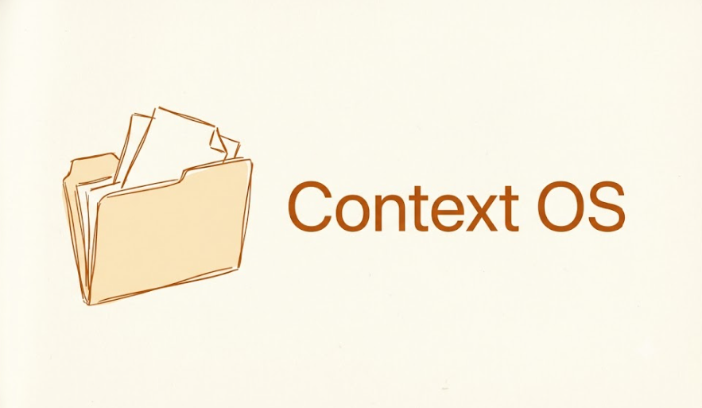
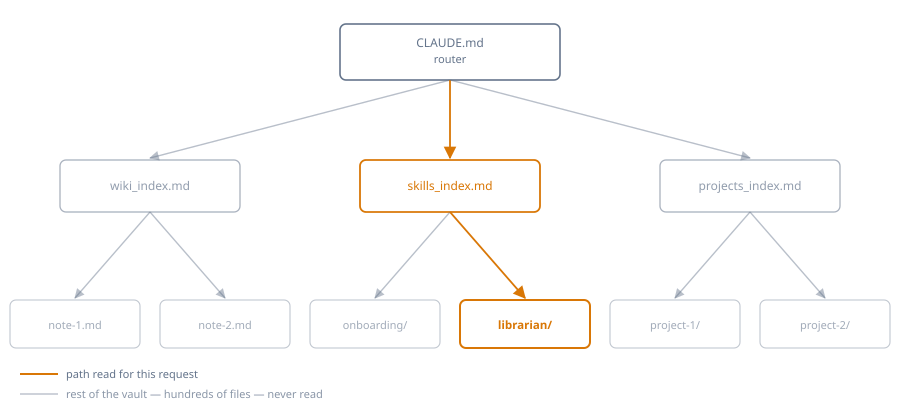

<p align="center">
  
</p>

<h1 align="center">Context_OS</h1>

<p align="center">
  <strong>The memory the AI reads by itself.</strong><br>
  Not another note-taking app that you read: the folder your assistant reads by itself, before it answers, in every new session.
</p>

<p align="center">
  <a href="LICENSE"></a>
</p>

<p align="center">
  <a href="#the-proof">The proof</a> ·
  <a href="#how-it-works">How it works</a> ·
  <a href="#how-to-start">How to start</a> ·
  <a href="#the-procedures">The procedures</a> ·
  <a href="#questions">Questions</a>
</p>

Open a chat. The AI doesn't know who you are, what you're working on, what you decided yesterday. You explain everything again. Tomorrow you start over.

The more projects you run in parallel, the more this costs: time, tokens, and decisions that get lost because they stayed inside a closed conversation.

---

## The proof

Install the system, open a conversation and write "hi". It asks you 3+1 questions, fills in the state, and you're up and running.

Then close the chat. Open a new one, days later:


You didn't tell it anything. It read it.

If you'd rather watch it than read it: 

https://github.com/user-attachments/assets/8a540cde-2ba5-4c79-a5e2-b9f745ce48b7

I ask for the status, I work, I open another chat: it's already updated. Nobody told it anything.

---

## How it works

The hard part of a knowledge base isn't reading or thinking — it's the bookkeeping: keeping indexes current, knowing where things live, not re-reading everything every time. Context_OS solves this with a router: `CLAUDE.md` never holds state, only the map to reach it. One request goes from the router to *one* index to *one* file — the rest of the folder, even hundreds of files, stays closed.

<p align="center">
  
</p>

<p align="center">
  <sub>Router → index → file: one path read per request</sub>
</p>

Inside there are three things:

**The rules** (`CLAUDE.md`) — what the assistant should do and where it should look. It's the file read first, automatically.

**The state** (`memory.md`) — who you are, what you're working on, what's pending. Changes constantly.

**The procedures** (`03_skills/`) — seven repeatable tasks the assistant knows how to run: opening a project, digesting raw notes into linked notes, checking that the system hasn't broken, distilling a competence into a file to call up later.

The rule that holds it all together: **rules never contain state.** A file that says "the active project is X" is stale in two days. Rules point to state, they never copy it.

---

## What it actually is

A folder of markdown files. No database, no account, no subscription, nothing running in the cloud. Opens in any editor, and with Obsidian you can even see the links as a graph.

---

## How to start

1. Download the folder and put it wherever you want on your computer.
2. Connect it to your AI (in Claude: select it as your working folder).
3. Open a conversation and write anything.

The system notices on its own that it's empty and asks you 3+1 questions. From there, you're up and running.

The procedures in `03_skills/` are already ready-to-use skills: on Claude Code they trigger themselves as soon as the folder is the one open, no extra step needed. On other assistants, install them by copying each `SKILL.md`'s content into a new skill from settings — the assistant will offer to do this during first run.

---

## What's inside

```
CLAUDE.md            rules + navigation map
memory.md            current state
archive.md           superseded decisions
00_context/          identity, distilled skills, feedback log
01_raw/              raw notes waiting to be digested
02_wiki/             consolidated knowledge, in linked atomic notes
03_skills/           the seven procedures
10_projects/         one folder per project
99_system/           the rulebook and templates
```

---

## The procedures

| Procedure | What it does | Benefit |
|---|---|---|
| Onboarding | Triggers itself on first run: 3+1 questions, fills in `memory.md`, opens the first project. | From empty folder to working system in a few minutes, without reading a single line of documentation. |
| Librarian | Sorts the raw material in `01_raw/`: atomic notes in the wiki for knowledge, folders and state in `10_projects/` for projects. | You dump everything in as it is, unsorted: what you'll re-read becomes knowledge, what you work on becomes a project. |
| Project Kick-off | Opens a new project: folder, rules, state, index entry. | No line of work is ever born orphaned or lost because it wasn't indexed. |
| Knowledge Pill | Distils a recurring competence into an operational file to call up when needed. | Explain a skill once, call it up forever — you never re-explain it again. |
| Specialize | Before assisting you on a subject with a literature of its own, it goes and fetches the evidence and distils it into a pill. | On what matters it doesn't answer off the cuff: it reads up first, and what it learns stays written down. |
| System Check | Checks for broken links, orphan files, stale paths, inconsistent naming and misaligned dates, and on a periodic run also duplicated content and rules that have drifted from practice. | The system stays reliable over time instead of quietly degrading until you stumble on it by accident. |
| Session Log | Closes a work session with a dated entry in the log. | Decisions and corrections don't vanish when you close the chat: they stay written, not left to memory. |

Onboarding triggers itself on the first message. The other six are skill folders (`<name>/SKILL.md`): on Claude Code they trigger themselves whenever the context calls for it, elsewhere they're installed one at a time from settings.

---

## What it doesn't do

It doesn't sync itself across devices: it's a folder, use whatever sync tool you prefer.

It doesn't automatically import notes you already have elsewhere. You drop them in `01_raw/` and have them digested whenever you want.

It's not built for several people on the same system: it's personal.

It was built and tested on Claude Cowork. Being plain text files with natural-language instructions, it works in principle with any AI that can read and write files — but it's only been verified on Claude Cowork.

---

## How it compares

| | Context_OS | Native memory (ChatGPT/Claude) | Notion templates (PARA/GTD) |
|---|---|---|---|
| Who reads what | The agent, alone, with an explicit map | The agent, but it decides what to keep — you don't see it | You, by hand |
| Where the data lives | Your files, on your disk | Inside the product's account | Inside Notion |
| Updates itself | Yes, with rules you write | Yes, opaquely | No |
| If you switch assistants | The folder works anywhere that reads text | Stays locked to the product | Stays locked to Notion |

It doesn't compete on how much it remembers: it competes on what you can see, control and take with you. The pattern it uses — a single index plus atomic notes, always read first — is also the setup most cited by the AI-agent community as the one that actually works without turning into a second job.

---

## The techniques it uses

- **Single source of truth** — every fact lives in exactly one file. Every other level holds a pointer, never a copy.
- **Compress, don't accumulate** — every work session closes with 1-2 dense lines in the log, not the full chat history.
- **Recurring cleanup** — broken links, orphan files, outdated paths: a dedicated check catches them before they pile up silently.
- **State, rules and history kept apart** — what's true now (`memory.md`), what's always true (`CLAUDE.md`), what's no longer true (`archive.md`) never mix.
- **A correction changes the rule, not just the log** — when you flag a structural problem, the assistant writes it down *and* rewrites the rule at its source in the same interaction. A log that changes nothing makes you repeat the same complaint next week.

---

<details id="questions">
<summary><strong>Questions</strong></summary>

**Is it different from a note-taking template?**
Those you read. This one the AI reads, by itself, every time.

**Do I need to know how to code?**
No. It's just reading and writing markdown.

**Where does my data go?**
On your computer. The system doesn't send anything anywhere.

**Does it use more tokens?**
Much less, and it's measurable: the vault I use every day is today ~400,000 words across 290 files. A typical session, guided by the router, reads 2,000-3,000 of them — under 1% of the total. The bigger the vault grows, the bigger the gap: without a map, orienting yourself would only get more expensive.

**What happens if I don't follow the rules?**
Nothing breaks. You lose order, not data: they're your files.

</details>

---

## What's next

Ideas under evaluation, not promises:

- A version for teams sharing folders in the cloud, so nobody works off a stale copy and the system stays current for everyone.
- A best-practices file to help onboard the user further.
- Automatic flagging of notes that haven't been read in months.

---

## Inspiration

The pattern goes back a while: Vannevar Bush imagined it in 1945 with the Memex, a personal archive with associative trails between documents — the part he couldn't solve was who does the maintenance. The direct idea is [Andrej Karpathy's LLM Wiki pattern](https://gist.github.com/karpathy/442a6bf555914893e9891c11519de94f): a wiki the LLM builds and maintains, not just queries. Context_OS is one instance of that pattern, with its own rules and structure.

---

## Feedback

Any feedback is welcome: criticism, ideas, cases the system doesn't cover.

I'm happy to help at any time: I want this to actually be useful to whoever uses it, not just to me — write to me anytime, for anything.
